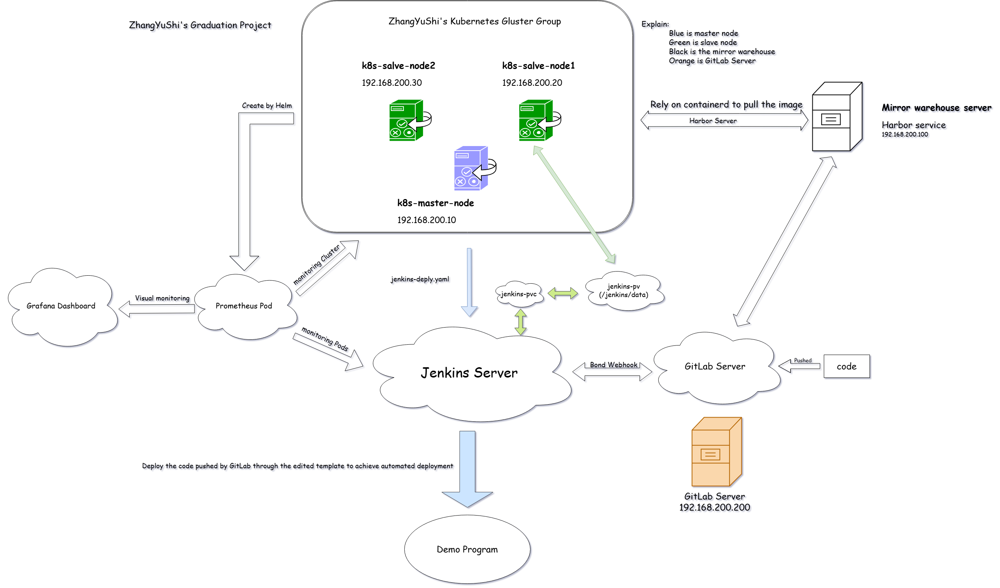

# KubeDevOps Platform

一个基于 **Ubuntu Server 24** 搭建的云原生 DevOps 平台，整合了 **Kubernetes、Jenkins、GitLab、Harbor、Prometheus、Containerd** 等组件，支持 CI/CD、镜像管理与监控。


## 功能特性
- Kubernetes 集群：1 个主节点 + 2 个从节点
- Jenkins：运行在 K8s 容器中，提供 CI/CD 流水线
- GitLab：代码托管与版本管理
- Harbor：镜像仓库，支持安全的镜像分发
- Prometheus + Grafana：监控与可视化
- Containerd：轻量级容器运行时

## 项目结构
```
KubeDevOps/
├── ci-cd/                         # CI/CD 配置文件（如 Jenkinsfile）
├── docs/                          # 文档与架构图
├── harbor-offline-installer-v2.10.2.tgz  # Harbor 离线安装包
├── k8s/                           # Kubernetes 部署文件 (YAML)
├── scripts/                       # 各类安装和初始化脚本
└── README.md                      # 项目说明文档
```
## 快速开始

1. 克隆仓库
```bash
git clone https://github.com/ZayvinShey/KubePipeline.git
cd KubePipeline
```
2. 初始化Kubernetes主节点 （!!! master脚本包含了Prometheus部署 !!!）
```bash
bash scripts/k8s-master.sh
```
3. 初始化从节点和Harbor节点 (Harbor不属于任何一台Kubernetes节点)
``` bash
bash scripts/k8s-slave-1.sh
bash scripts/k8s-slave-2.sh
---
bash scripts/Harbor.sh
```
### Harbor

### Grafana 访问方式

- 默认用户名：`admin`
- 默认密码：脚本会自动打印
- 访问地址：`http://master-ip:脚本打印


4. 部署 Jenkins
```
kubectl apply -f k8s/jenkins-deployment.yaml
kubectl apply -f k8s/docker-dind.yaml
```

---

## 功能说明（组件介绍）

```markdown
- **Kubernetes**：容器编排与集群管理
- **Containerd**：轻量级容器运行时
- **Jenkins**：持续集成与自动化构建
- **GitLab**：代码托管与版本控制
- **Harbor**：私有镜像仓库，支持 TLS 和用户权限
- **Prometheus + Grafana**：集群监控与可视化仪
```

---
## 环境要求

- 操作系统：Ubuntu Server 24.04
- 节点配置：1 个主节点 + 2 个从节点
- 网络要求：可访问阿里云镜像源（或配置代理）
- 必备工具：
  - containerd
  - kubeadm / kubectl / kubelet
  - Helm
  - curl / wget / ntpdate

---
## TODO
- [ ] 增加 CI/CD 流程示例
- [ ] 提供 Helm Chart 部署方式
- [ ] 集成 ArgoCD 或 GitOps 流程
- [ ] 增加自动化脚本一键部署所有组件
---
##项目声明

本项目由 [ZayvinShey](https://github.com/ZayvinShey) 独立编写与维护，旨在帮助开发者快速搭建完整的 DevOps 学习与实践平台。内容涵盖 Kubernetes、Jenkins、GitLab、Harbor、Prometheus、Containerd 等核心组件，适用于学习环境与生产部署。

本项目遵循 MIT License 开源协议，欢迎自由使用、学习与贡献。如有建议或问题，欢迎提交 Issue 或 Pull Request。

如果你觉得这个项目对你有帮助，欢迎 Star 支持一下 ⭐！


